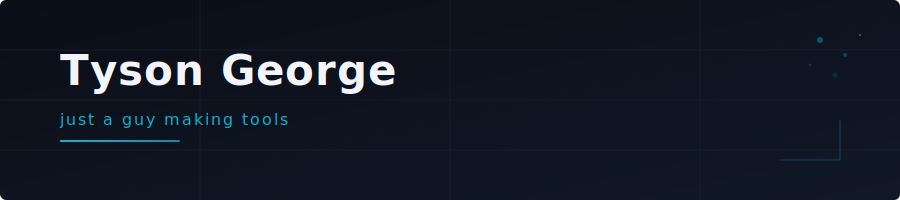

<picture>
  
</picture>

&nbsp;

Senior engineer from Ohio, writing code since 2009. Building open-source dev tools at [TysonLabs](https://github.com/TysonLabs) by night — AI tinkerer and gamer by later night.

&nbsp;

### `PROJECTS`

| | Project | Description | Install |
|---|---------|-------------|---------|
| **>** | [**lazyide**](https://github.com/TysonLabs/lazyide) | Terminal IDE — LSP, 32 themes, git integration | `curl -fsSL https://tysonlabs.dev/lazyide/install.sh \| sh` |

&nbsp;

### `STACK`

&nbsp;

**[TysonLabs](https://github.com/TysonLabs)** · [tysonlabs.dev](https://tysonlabs.dev)
